# Crud for sofka challenge

Crud of users with roles in SpringBoot and MYSQL.

# Summary of the problem to solve

For this challenge we were asked to create an application that contained an entity that was in charge of creating users in a MYSQL database, at the same time we needed another entity that was in charge of creating the user roles, the user creation entity and the entity to create the roles have to be connected to each other.

# How entities are related

As stated in the challenge, the users that were created in the app could have as many roles as needed, but the roles only needed to be bound to a single user, so in my opinion, I decided that the most optimal way to fulfill with the two conditions to relate the entities is to make use of OneToMany and ManyToOne.

## OneToMany

With OneToMany we can link a user with as many roles as we need so that the application users can have as many roles as possible.

## ManyToOne

With ManyToOne it is totally the opposite of OneToMany since with it we can link a large number of roles to a single user.

# How API requests work

Next, some screenshots were attached to this document where the correct functioning of the api can be evidenced.

## Request to bring all users

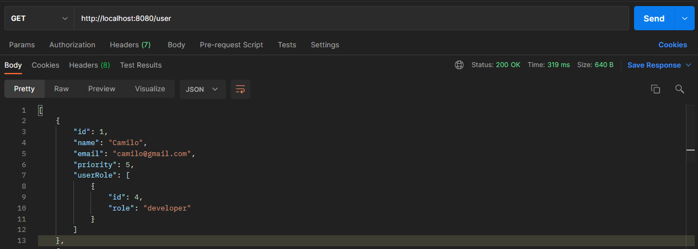

## Request to create users

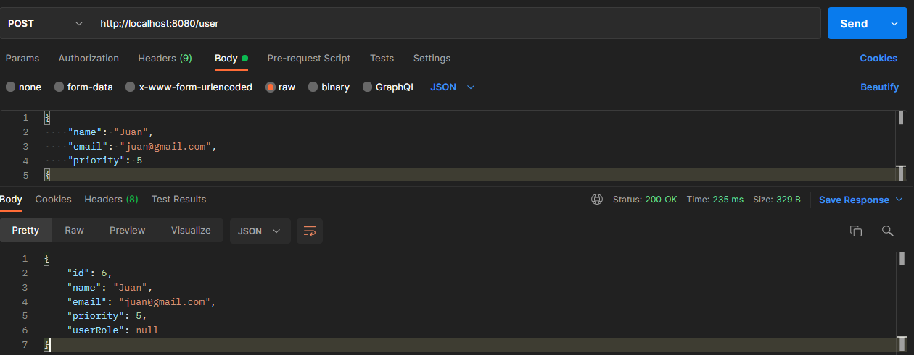

## Request to get user by id

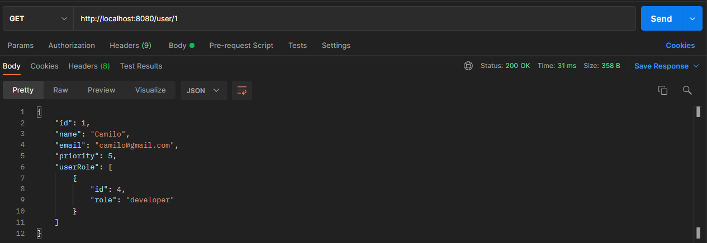

## Request to get user by priority

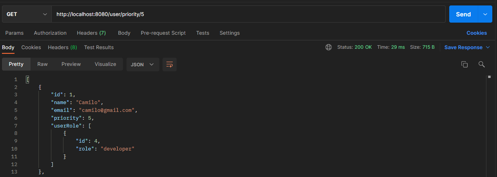

## Request to update users

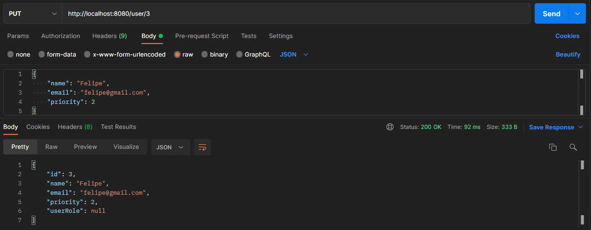

## Request to delete users

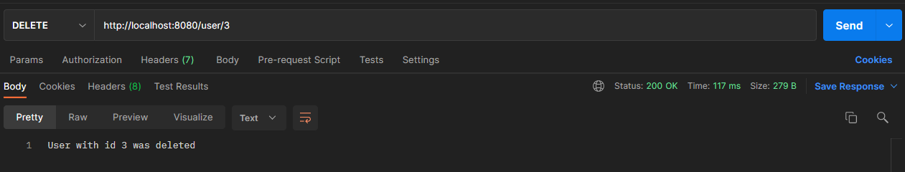

## Request to bring all roles

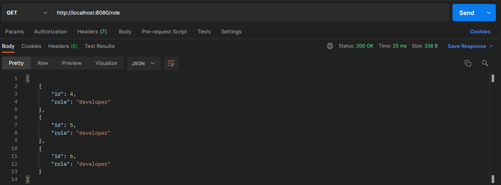

## Request to create role

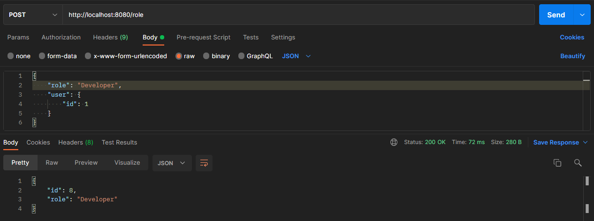

## Request to get role by id

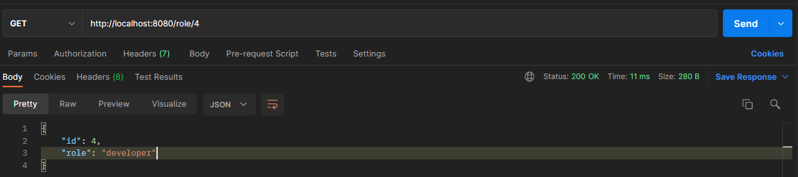

## Request to update roles

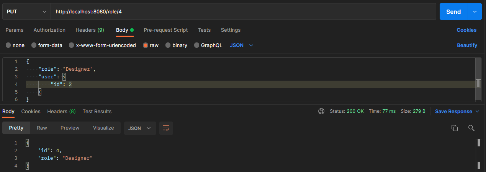

## Request to delete roles

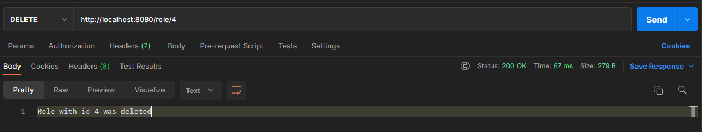
